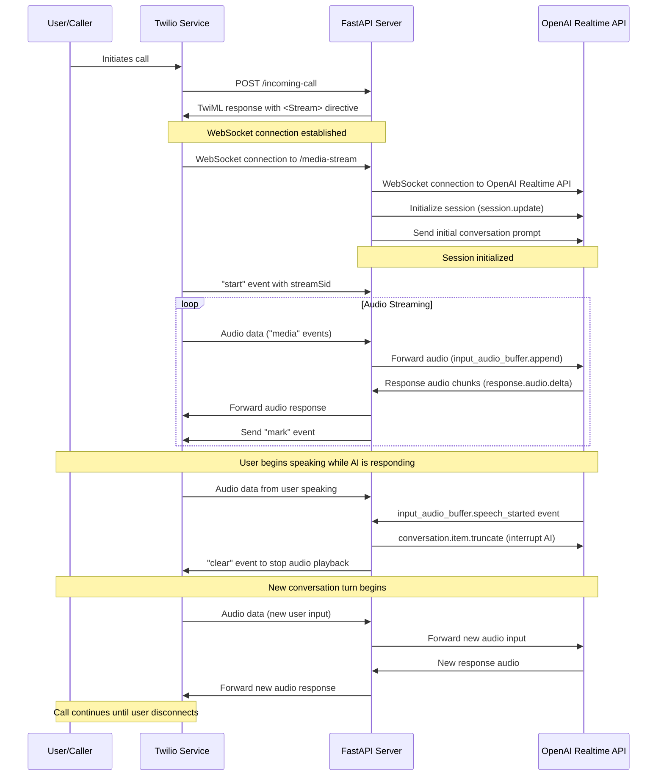

```mermaid
sequenceDiagram
participant User as User/Caller
participant Twilio as Twilio Service
participant Server as FastAPI Server
participant OpenAI as OpenAI Realtime API

    User->>Twilio: Initiates call
    Twilio->>Server: POST /incoming-call
    Server->>Twilio: TwiML response with <Stream> directive

    Note over Twilio,Server: WebSocket connection established

    Twilio->>Server: WebSocket connection to /media-stream
    Server->>OpenAI: WebSocket connection to OpenAI Realtime API

    Server->>OpenAI: Initialize session (session.update)
    Server->>OpenAI: Send initial conversation prompt

    Note over Server,OpenAI: Session initialized

    Twilio->>Server: "start" event with streamSid

    loop Audio Streaming
        Twilio->>Server: Audio data ("media" events)
        Server->>OpenAI: Forward audio (input_audio_buffer.append)
        OpenAI->>Server: Response audio chunks (response.audio.delta)
        Server->>Twilio: Forward audio response
        Server->>Twilio: Send "mark" event
    end

    Note over User,OpenAI: User begins speaking while AI is responding

    Twilio->>Server: Audio data from user speaking
    OpenAI->>Server: input_audio_buffer.speech_started event
    Server->>OpenAI: conversation.item.truncate (interrupt AI)
    Server->>Twilio: "clear" event to stop audio playback

    Note over User,OpenAI: New conversation turn begins

    Twilio->>Server: Audio data (new user input)
    Server->>OpenAI: Forward new audio input
    OpenAI->>Server: New response audio
    Server->>Twilio: Forward new audio response

    Note over User,Twilio: Call continues until user disconnects
```
